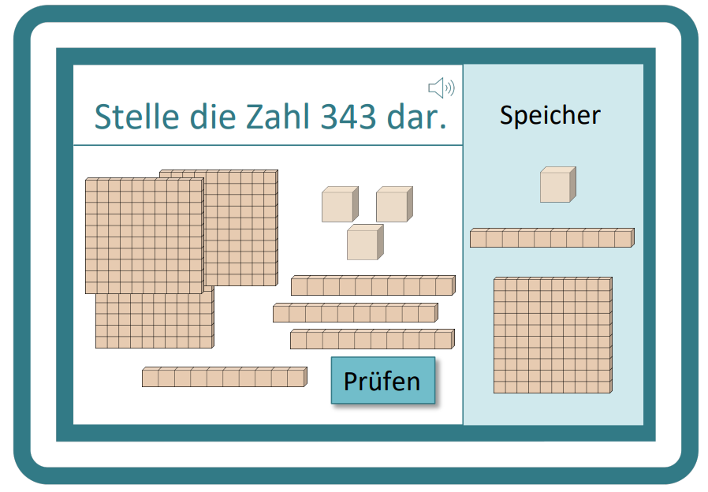
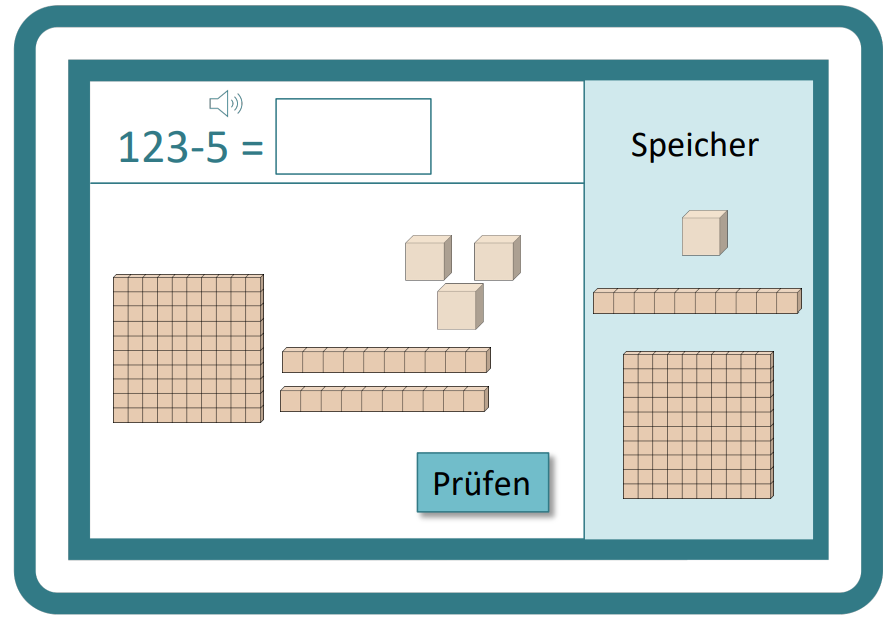
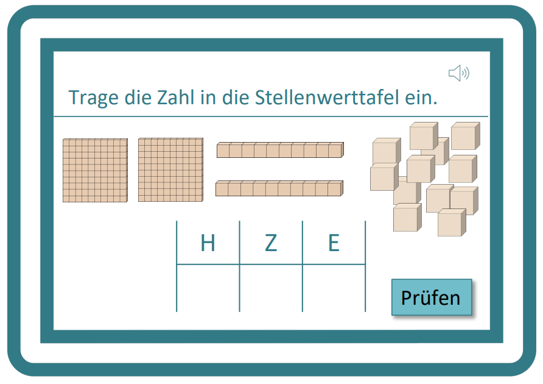
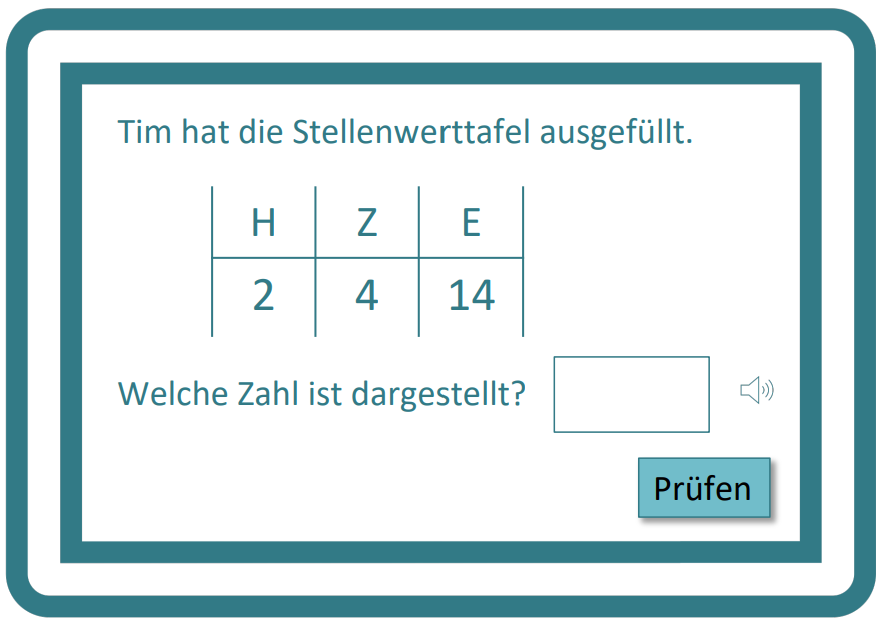

Dienes-Material I
==============
Aufgabe: Zahl soll mit Dienes Material dargestellt werden
- [ ] Klick für Sortierung
- [ ] In Schwierigkeitsgrad einteilen (leicht &rarr; 0-100 ; Schwierig &rarr; 100-1000)
- [ ] Möglichkeit um Aufgabe zu korrigieren &rarr; Button?
	- [ ] Möglichkeit etwas wieder rauszuziehen oder reinzuschieben
- [ ] Besseres Feedback
- [ ] unkonventionelle Darstellung 
	- [ ] Feedback &rarr; Hinweis für bessere Darstellung geben

Dienes-Material II
============== 
Aufgabe: Rechnung soll mit Hilfe des Dienes Materials gelöst werden
- [ ] Klick zum Entbündeln &rarr; Doppelklick?
- [ ] Einkreisen für Bündeln
- [ ] Additionsaufgaben
- [ ] Subtraktionsaufgaben 
- [ ] In Schwierigkeitsgrad einteilen
- [ ] unkonventionelle Darstellung

Stellenwerttafel I
=============
Aufgabe: Zahl ist mit Dienes Material gegeben und soll in der Stellenwerttafel eingetragen werden
- [ ] Stift und Handschrifterkennung
- [ ] Unkonventionelle Darstellung 
- [ ] In Schwierigkeitsgrad einteilen

Stellenwerttafel II
==============
Aufgabe: Zahl in der Stellenwerttafel soll korrigiert und als Symbol eingegeben werden
- [ ] Unkonventionelle Darstellung 

